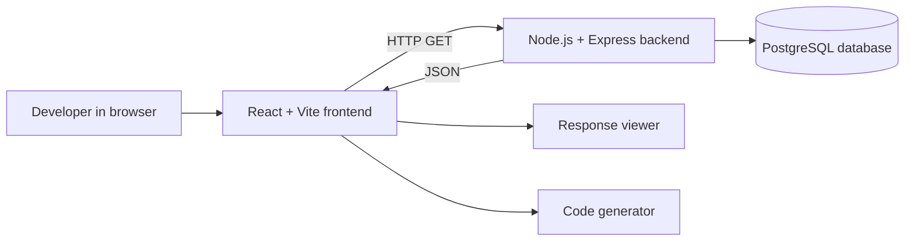

# API Playground - High-Level Design

**Version:** 1.0  
**Status:** Current-state design  
**Date:** 2026-08-19

## 1. Overview

API Playground is a browser-based developer tool for exploring a healthcare sample API. A user selects Doctors or Patients, chooses supported filters, reviews the generated request URL, fetches JSON data, and views client examples in JavaScript, Java, Python, or C++.

The current product is read-only. It does not implement authentication, CRUD operations, pagination, API versioning, or production patient-data controls.

## 2. Goals

- Make available API resources easy to discover.
- Build reproducible filtered URLs without manual query-string construction.
- Return filtered data from PostgreSQL through a modular Express API.
- Show response states and generated integration code in one workflow.
- Provide an extension point for adding more resources and filters.

## 3. System Context

## 4. Logical Components

### Frontend

- `App.jsx` mounts the Home page.
- `Home.jsx` composes the page sections, including `ApiExplorer`.
- `ApiExplorer` owns resource selection, filters, generated URL, fetch state, and response state.
- `apiConfig.js` defines the resource labels, endpoint paths, and dropdown options.
- `ResponseViewer` displays loading, error, empty, and formatted JSON states.
- `CodeGenerator` produces request examples for four languages using the current URL.
- `VITE_API_URL` identifies the backend base URL at build time.

### Backend

- `server.js` loads environment variables and starts the HTTP process.
- `app.js` configures JSON parsing, CORS, the health route, and resource routers.
- Routes map HTTP paths to controllers.
- Controllers handle HTTP status codes and delegate work to services.
- Services provide an application boundary between controllers and persistence.
- Models construct parameterized SQL and execute it with a PostgreSQL pool.

### Database

The `pg` connection pool is configured with `DB_HOST`, `DB_PORT`, `DB_NAME`, `DB_USER`, and `DB_PASSWORD`. The model layer reads from `doctors` and `patients` tables. Database migrations or schema files are not currently present in the repository.

## 5. Request Flow

1. The user selects a resource in the React explorer.
2. The UI loads that resource's filter metadata from `apiConfig.js`.
3. Selected values are URL-encoded and combined into a query string.
4. The user fetches the displayed URL.
5. Express routes the request to the relevant controller.
6. The service delegates to the resource model.
7. The model builds a parameterized `SELECT *` query with `AND` predicates.
8. The controller returns rows as JSON.
9. React renders the response and uses the same URL in generated code.

## 6. Deployment View

A typical deployment consists of:

- A Vite production build served by a static host or CDN.
- A Node.js backend process exposed at the URL configured by `VITE_API_URL`.
- A managed PostgreSQL instance accessible by the backend.
- Environment variables supplied by the hosting environment.

The current backend uses permissive CORS and database SSL with certificate verification disabled. Production should restrict CORS to the frontend origin and use verified database certificates.

## 7. Quality Attributes

- **Maintainability:** The route/controller/service/model separation supports new resources.
- **Security:** SQL values are parameterized, but authentication, validation, rate limiting, and strict CORS are not implemented.
- **Performance:** Pooling supports concurrent database requests, but queries have no pagination, limits, or explicit column selection.
- **Usability:** The explorer combines filters, URL, response, and code examples.
- **Availability:** There is a root route but no database readiness check, centralized error middleware, or retry policy.

## 8. Risks and Future Direction

- Frontend filter metadata and backend query rules are maintained separately and can drift.
- Doctor assignment options use fixed IDs in the frontend.
- Error response formats differ between doctor and patient controllers.
- Unknown or invalid filter values are not consistently rejected.
- Any real healthcare data would require privacy, access-control, auditing, and retention controls.

A shared OpenAPI contract, validation layer, pagination, consistent errors, and automated tests are recommended before production use.
