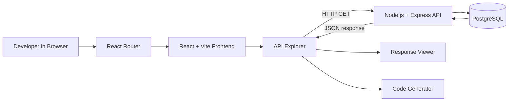

# API Playground - High-Level Design

**Version:** 1.1  
**Status:** Current-state design  
**Date:** 2026-09-02

## 1. Overview

API Playground is a browser-based developer tool for exploring a healthcare sample REST API.

A developer can navigate application pages, select Doctors or Patients, choose supported filters, generate a reproducible request URL, fetch filtered JSON data, inspect response states, and generate integration examples in JavaScript, Java, Python, and C++.

The architecture follows:

`React + Vite frontend → HTTP REST API → Node.js + Express backend → PostgreSQL`

The frontend uses React Router for client-side navigation. Current routes are:

- `/` → Home
- `/about` → About
- `*` → NotFound

The system is read-only. Authentication, CRUD operations, pagination, API versioning, and production healthcare-data controls are not implemented.

## 2. Design Goals

### 2.1 Resource Discoverability

Doctors and Patients are exposed through the API explorer. Resource definitions are centralized in:

`frontend/src/data/apiConfig.js`

This contains resource labels, endpoint paths, and supported filter options.

### 2.1.1 Configuration-Driven Resource Discovery

Resource discovery is implemented using a centralized configuration model in:

`frontend/src/data/apiConfig.js`

Each resource definition contains:

- Resource label
- Endpoint path
- Supported filters
- Filter labels
- Available filter options

`ApiExplorer.jsx` reads the configuration for the currently selected resource and uses it to determine which filters are displayed and which endpoint is used to generate the request URL.

For example:

`Doctors → /doctors → specialization, availability, experience`

`Patients → /patients → gender, age, doctorAssigned, amountToBePaid, sickness`

This design avoids duplicating resource-specific configuration across multiple UI components.

### Design Benefit

Adding another read-only resource can follow the same configuration pattern instead of requiring the explorer UI to be rewritten for each resource.

This improves resource discoverability, maintainability, and extensibility.

### 2.2 Reproducible API Requests

Users select filters through UI controls. Selected values are URL-encoded and combined with the selected endpoint to create the request URL.

The displayed URL can therefore be reused as a reproducible API request.

### 2.3 Separation of Responsibilities

The backend separates:

`Routes → Controllers → Services → Models`

This prevents HTTP handling, application logic, and database access from being placed in one module.

### 2.4 Client-Side Navigation

React Router provides client-side navigation between application pages without complete browser page reloads.

This directly supports the PRD requirement for a smooth browser-based application experience.

### 2.5 Integrated API Exploration Workflow

The API explorer combines:

`Resource → Filters → Generated URL → Response → Generated Code`

This keeps request construction and API inspection in one workflow.

## 3. PRD-to-HLD Traceability

| PRD Requirement | HLD Decision | Implementation |
|---|---|---|
| Discover available resources | Centralize resource metadata | `frontend/src/data/apiConfig.js` |
| Build filtered requests without memorizing syntax | Generate query parameters from UI filters | `ApiExplorer.jsx` |
| See exact request URL | Maintain generated URL in frontend state | `ApiExplorer.jsx` |
| Inspect API responses | Separate response rendering | `ResponseViewer.jsx` |
| Generate integration examples | Generate examples from current URL | `CodeGenerator.jsx` |
| Navigate without full page reloads | React Router with BrowserRouter and explicit routes | `main.jsx`, `App.jsx` |
| Handle unknown application routes | Wildcard route | `App.jsx` → `NotFound` |
| Separate backend responsibilities | Route/controller/service/model layers | `backend/src/routes`, `controllers`, `services`, `models` |
| Retrieve persistent API data | PostgreSQL connection pool | `backend/src/config/db.js`, model files |

This traceability connects product requirements directly to architecture and implementation.

## 4. System Context



### Main Interaction

1. The developer opens the application.
2. React Router determines the frontend page.
3. The Home page contains the API explorer.
4. The developer selects Doctors or Patients.
5. `apiConfig.js` provides supported filters.
6. The explorer generates the request URL.
7. The browser sends an HTTP GET request.
8. Express processes the request through its backend layers.
9. The model executes a parameterized PostgreSQL query.
10. The backend returns JSON.
11. React renders the response and uses the same URL for code generation.

## 5. Frontend Architecture

### 5.1 Application Entry Point

`frontend/src/main.jsx`

The application is wrapped with `BrowserRouter`.

This establishes the React Router context required by `Routes`, `Route`, and `NavLink`.

### 5.2 Application Routing

`frontend/src/App.jsx`

The current route configuration is:

```jsx
<Routes>
    <Route path="/" element={<Home />} />
    <Route path="/about" element={<About />} />
    <Route path="*" element={<NotFound />} />
</Routes>
```

The `BrowserRouter` is provided in `main.jsx`.

`Navbar` and `Footer` are outside the `Routes` block, so they remain shared across application pages.

### Routing Rationale

React Router was selected because the application is a browser-based single-page application.

The routing design provides:

- Navigation without complete document reloads.
- Explicit URL-to-component mapping.
- Separation between page navigation and API request state.
- A defined fallback for unknown frontend routes.

The wildcard route prevents unmatched application paths from leaving the user without a defined page.

## 6. Frontend Component Architecture

### `Home.jsx`

The primary application page. It composes the main API exploration sections, including `ApiExplorer`.

### `ApiExplorer.jsx`

Owns the main API exploration workflow:

- Selected resource.
- Selected filters.
- Generated request URL.
- Response data.
- Loading state.
- Error state.

It creates query parameters from selected filters and sends the generated URL through `fetch()`.

### `apiConfig.js`

Acts as frontend API metadata/configuration.

It defines:

- Resource names.
- Endpoint paths.
- Supported filters.
- Filter options.

This reduces duplication and gives the explorer a central source for supported frontend resource options.

### `ResponseViewer.jsx`

Handles presentation of:

- Loading.
- Error.
- Empty.
- Formatted JSON states.

This separates response presentation from request construction.

### `CodeGenerator.jsx`

Generates request examples for:

- JavaScript
- Java
- Python
- C++

The examples use the current generated URL so the generated code represents the same request shown in the explorer.

## 7. Backend Architecture

The backend follows:

`HTTP Request → Route → Controller → Service → Model → PostgreSQL`

### 7.1 `server.js`

Loads environment configuration and starts the HTTP server.

### 7.2 `app.js`

Configures:

- Express JSON parsing.
- CORS.
- Root health route.
- Doctor router.
- Patient router.

The resource endpoints are:

`GET /api/doctors`

`GET /api/patients`

### 7.3 Routes

Routes map HTTP methods and paths to controller functions.

The doctor route connects GET requests with query validation middleware and the doctor controller.

### 7.4 Controllers

Controllers handle HTTP-facing responsibilities:

- Receive the request.
- Obtain query information.
- Call the service layer.
- Return an HTTP response.

### 7.5 Services

Services provide an application-level boundary between controllers and persistence.

Controllers therefore do not need to construct database queries directly.

### 7.6 Models

Models contain database access logic.

They construct parameterized SQL queries and execute them through the PostgreSQL connection pool.

Parameterized values keep user-provided filter values separate from SQL structure.

## 8. Database Architecture

The backend uses the `pg` package and a PostgreSQL connection pool.

Connection configuration uses:

- `DB_HOST`
- `DB_PORT`
- `DB_NAME`
- `DB_USER`
- `DB_PASSWORD`

The model layer reads from:

- `doctors`
- `patients`

The patient model uses `doctor_id` when filtering by assigned doctor.

The repository does not contain database migration files or a formal schema definition. Therefore, the database structure is treated as an environment assumption rather than something automatically created by the application.

### 8.1 Filtered Data Retrieval Design

Filtered retrieval follows the same layered architecture:

`HTTP Query Parameters → Controller → Service → Model → PostgreSQL`

For example, a request such as:

`GET /api/doctors?specialization=Cardiologist&experience=5`

is processed by the doctor resource handler.

The model converts the selected filters into parameterized SQL conditions:

`specialization = $1`

`experience >= $2`

The values are passed separately to PostgreSQL through the `pg` connection pool.

Multiple selected filters are combined using `AND` conditions.

This allows the same endpoint to support both unfiltered retrieval and progressively filtered resource discovery.

## 9. API Request and Data Flow

### Step 1 — Resource Selection

The user selects Doctors or Patients in `ApiExplorer`.

### Step 2 — Filter Configuration

The explorer obtains supported filters from `apiConfig.js`.

### Step 3 — URL Generation

Selected non-empty filter values become query parameters.

Values are URL-encoded before being placed in the request URL.

Example:

`/api/doctors?specialization=Cardiology&experience=5`

### Step 4 — HTTP Request

The browser sends a GET request to the generated URL.

### Step 5 — Routing

Express matches the request to the appropriate resource router.

### Step 6 — Validation

Where implemented, query validation middleware checks supported parameters and applicable values before the controller continues.

### Step 7 — Controller

The controller handles the HTTP request and delegates application work.

### Step 8 — Service

The service delegates persistence work to the appropriate model.

### Step 9 — Model

The model builds a parameterized SQL query using the selected filters.

### Step 10 — PostgreSQL

PostgreSQL executes the query and returns matching rows.

### Step 11 — JSON Response

The backend returns the result as JSON.

### Step 12 — Frontend Rendering

React updates response state and `ResponseViewer` presents the result.

### Step 13 — Code Generation

The same generated URL is passed to `CodeGenerator` so the displayed request and generated examples remain consistent.

## 10. Client-Side Routing Flow

```text
User clicks Navbar link
        ↓
NavLink
        ↓
React Router
        ↓
URL changes
        ↓
Routes matches path
        ↓
Corresponding component renders
```

Current route mapping:

| Path | Component | Purpose |
|---|---|---|
| `/` | `Home` | Main API Playground |
| `/about` | `About` | Project information |
| `*` | `NotFound` | Unmatched application paths |

The Navbar uses React Router navigation links.

This keeps page navigation separate from API-fetching concerns. Navigation is handled by React Router, while API filtering and response state remain inside `ApiExplorer`.

## 11. Deployment View

```text
Browser
   ↓
Static React/Vite frontend
   ↓
Node.js + Express backend
   ↓
Managed PostgreSQL database
```

The frontend uses `VITE_API_URL` to identify the backend base URL.

Environment-specific values are supplied through environment variables rather than hard-coded database credentials.

The current implementation uses permissive CORS and disables database SSL certificate verification. Production deployment should restrict CORS to trusted frontend origins and verify database certificates.

## 12. Quality Attributes

### Maintainability

The frontend separates routing, page composition, API exploration, response rendering, and code generation.

The backend separates:

`Routes → Controllers → Services → Models`

This makes resource-specific changes easier to isolate.

### Security

Database values are passed through parameterized queries.

Authentication, authorization, rate limiting, and production-grade CORS restrictions are not currently implemented.

### Performance

The backend uses a PostgreSQL connection pool so database connections can be reused across requests.

Pagination, query limits, and explicit column selection are not currently implemented.

### Usability

The API explorer keeps resource selection, filtering, generated URL, response data, and generated code within one workflow.

### Availability

The application provides a root health route, but does not currently implement database readiness checks, centralized error middleware, or retry policies.

## 13. Design Decisions and Rationale

### Decision 1 — React Router

**PRD requirement:** Users should navigate between application pages without unnecessary full-page browser reloads.

**HLD decision:** Use React Router with `BrowserRouter`, `Routes`, `Route`, and `NavLink`.

**Implementation:** `main.jsx` provides the `BrowserRouter` context and `App.jsx` maps `/`, `/about`, and `*`.

**Reason:** It provides explicit URL-to-component mapping while keeping normal application navigation on the client.

**Benefit:** Navigation is separated from API request state and unknown routes have a defined fallback.

### Decision 2 — Configuration-driven resource discovery and filters

PRD requirement: Users should easily discover available API resources and their supported filters.

HLD decision: Store resource metadata, endpoint paths, labels, and filter definitions centrally in frontend/src/data/apiConfig.js.

Implementation: ApiExplorer.jsx reads the selected resource configuration and uses its endpoint and filters to construct the request.

Reason: This avoids hard-coding resource-specific UI logic in multiple components.

Benefit: Adding another resource primarily requires adding its configuration rather than rewriting the entire explorer.

### Decision 3 — Layered backend data retrieval

PRD requirement: Filtered resource data should be retrieved through a maintainable backend architecture.

HLD decision: Separate HTTP routing, controller handling, service delegation, and database access.

Implementation: /api/doctors routes through the doctor controller and service before reaching doctorModel.js.

Reason: Controllers don't directly construct SQL queries.

Benefit: Database logic remains isolated and additional resources can follow the same pattern..

### Decision 4 — Parameterized SQL

**PRD requirement:** Filtered data should be retrieved safely from PostgreSQL.

**HLD decision:** Models use parameterized SQL.

**Reason:** Query values are passed separately from SQL structure rather than directly concatenated into SQL.

### Decision 5 — Shared Generated URL

**PRD requirement:** Developers should be able to reproduce API requests.

**HLD decision:** Use the same generated URL for the API request and code generation.

**Reason:** The displayed request and generated integration examples cannot accidentally represent different URLs.

## 14. Current Limitations and Risks

- Frontend filter metadata and backend query rules are maintained separately.
- Doctor assignment options use fixed IDs in the frontend.
- Error response formats are not completely standardized.
- Invalid filter values are not consistently rejected across all resources.
- No formal database migration/schema files are included.
- No authentication or authorization exists.
- Large result sets are not paginated.
- Production healthcare data would require additional privacy and security controls.

## 15. Future Architecture Improvements

Before production use, the architecture can be extended with:

1. Shared OpenAPI specification.
2. Centralized request validation.
3. Standardized API error responses.
4. Pagination and query limits.
5. Database migrations.
6. Automated frontend and backend tests.
7. Strict production CORS.
8. Authentication and authorization if protected resources are introduced.
9. Database readiness monitoring.
10. Centralized logging and observability.
